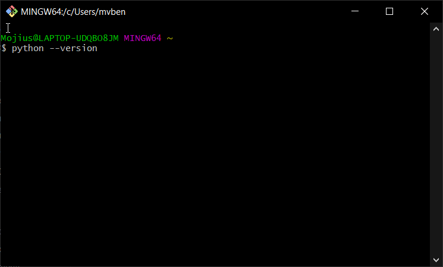
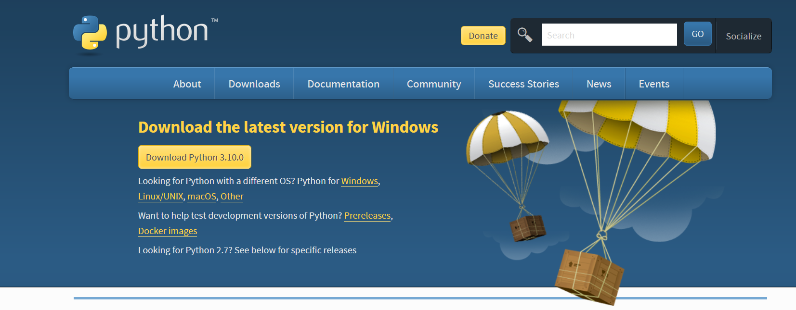
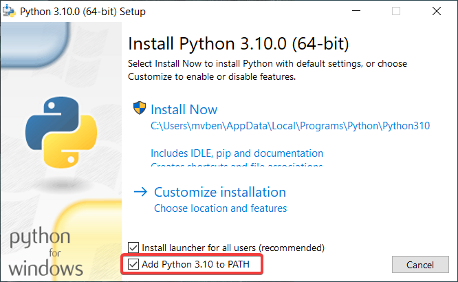
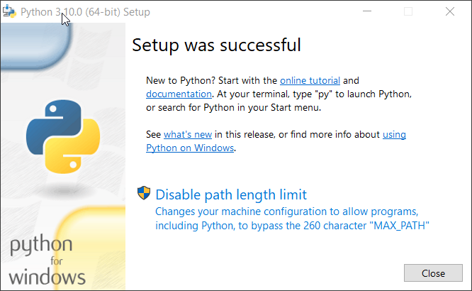

# python-intro

## Welcome! 

We're going to show you how to get started with the programming language Python. If you made it this far, you probably know the basics of git and version control. If you don't, make sure you've finished following that guide. <---- [[PUT LINK THERE ]]

**But first, we need to make sure you have Python installed on your device.**

# LESSON 1: Installing Python

## Checking your existing version of Python

Using your existing shell program of choice (Command Prompt on Windows, for instance, is a shell program, and so is Terminal on Mac. Git Bash is also a shell program), simply go into the shell environment, type `python --version`, and hit `enter`. Here's a picture of me doing this using Git Bash on Windows:

# L1-I. How to install or upgrade to Python 3.X (Windows)

## 1. Go to [this website](https://www.python.org/downloads/) and download the latest version of Python by clicking the big "Download Python 3.10.0" button.

## 2. Download and run the program. Before you click "Install Now," MAKE SURE you check "Add Python 3.10 to PATH" first!

## 3. Once Python is finished installing, click "Disable path length limit" and you're done! :)

# L1-II. How to install or upgrade to Python 3.X (Mac)

# L1-III. How to install or upgrade to Python 3.X (Linux)
